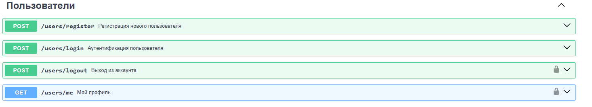
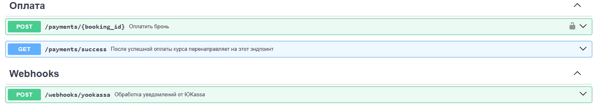
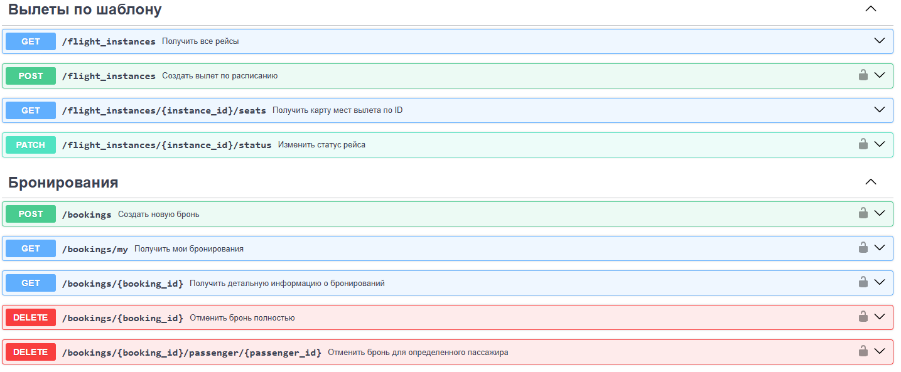
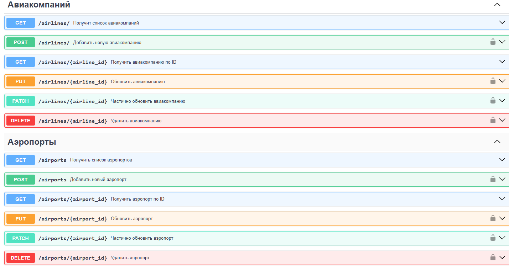
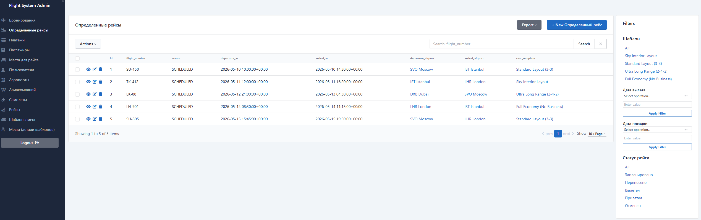
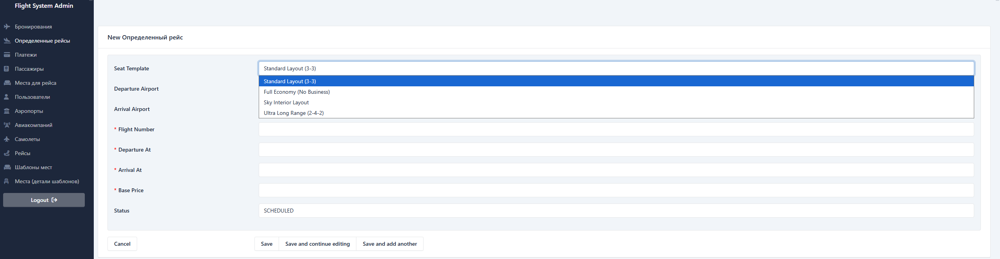

Flight Booking System API


Backend-сервис для управления авиаперелетами, бронированием и автоматической генерацией карт мест.

🌟 Основные возможности:

Динамическая генерация мест: Автоматическое создание SeatInstance на основе шаблонов при создании рейса.

Кэширование: Оптимизация тяжелых запросов (поиск рейсов) через Redis.

Админ-панель: Интеграция с sqladmin для управления API

Type Safety: 100% покрытие типов, проверенное через Pyright.

Yookassa: Интеграция с платежной системой Yookassa для оплаты бронирований

Автоматизация (Celery):

1. Автоматическая отмена бронирования, если оплата не поступила в течение 15 минут.
2. Рассылка подтверждений о покупке билетов на Email после успешной транзакции.

🛠 Технологический стек

1) Framework: FastAPI
2) ORM: SQLAlchemy 2.0
3) Migrations: Alembic
4) Validation: Pydantic v2
5) Task Queue: Celery + Redis (для фоновых задач)
6) Security: JWT Authentication + Password Hashing

## 🖥 1. Документация API (Swagger UI)

После запуска доступна по адресу: http://127.0.0.1:8000/docs

## Скриншоты проекта

### Эндпоинты Пользователей


### Эндпоинты Оплаты


### Эндпоинты Бронирований и рейсов


### Эндпоинты Авиакомпаний и аэропортов



### 🖥 2. Панель администратора (SQLAdmin)

После запуска доступна по адресу: http://127.0.0.1:8000/admin/

Интуитивно понятный интерфейс для управления ресурсами системы:

* **Управление рейсами**: Быстрое создание и корректировка расписания.
* **Шаблоны самолетов**: Визуальное управление компоновкой мест.


*Просмотр списка активных рейсов с фильтрацией по аэропортам.*


*Удобная форма создания рейса с автоматической привязкой к аэропортам и шаблонам.*

# 💳 Настройка платежей (Yookassa)

Для тестирования функционала оплаты:
1. Зарегистрируйте тестовый магазин в [ЮKassa для разработчиков](https://yookassa.ru/developers/using-api/basics).
2. Скопируйте `shopId` и `Secret Key`.
3. Вставьте их в соответствующие поля в `.env`.
*Если ключи не указаны, создание платежа будет возвращать ошибку 401.*

# ⚠️ Важно для работы Webhooks
Для того чтобы система узнала об успешной оплате, необходимо:
1. Запустить **ngrok** на порту 8000: `ngrok http 8000`.
2. Скопировать полученный адрес (например, `https://abc-123.ngrok-free.app`).
3. В личном кабинете ЮKassa в разделе "Webhooks" указать этот адрес с путем:
   `https://ваша-ссылка.ngrok-free.app/webhooks/yookassa`

## 🖥Как запустить проект.

1. **Клонируйте репозиторий**: 
    ```bash
    git clone https://github.com/olzhasraxmetov-lgtm/flight_project
    cd flight-api

1. **Создайте файлы конфигурации из шаблонов:**
   ```bash
   cp .env.example .env
   cp .env.test_example .env.test

2. **Запустите проект:**
    ```bash
    docker-compose up -d --build

4. **Примените миграций**:
    ```bash
    docker-compose exec flight_app alembic upgrade head

#  🧪 Тестирование
Проект покрыт интеграционными и unit-тестами. 
Для запуска тестов используйте:
```bash
    pytest -v tests/